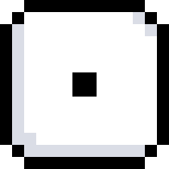
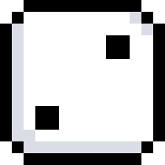
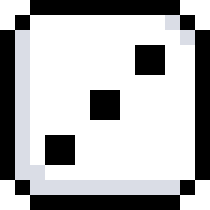
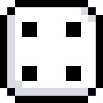

# 🎲 Knucklebones

A fan-made digital version of **Knucklebones**, the dice minigame featured in game ***Cult of the Lamb***.

The original game mechanics and rules are inspired by the implementation found in *Cult of the Lamb*. All programming, interface design, visual assets, and frontend implementation in this project were created independently by me.

---

### About the Game

Knucklebones is a two-player turn-based dice game in which the player with the highest score wins.

Players take turns rolling and placing dice on their board. Points are calculated by adding the values of all dice on a player's board.
However, matching dice placed within the same column receive multipliers:
- Two matching dice in a column double their value.
- Three matching dice in a column triple their value.

Players can also destroy an opponent's dice by placing a die with the same value in the corresponding column on their own board.

The game ends when either player's board is completely filled.

---

<div align="center">

 &nbsp;&nbsp; &nbsp;&nbsp; &nbsp;&nbsp; &nbsp;&nbsp; &nbsp;&nbsp; 
 &nbsp;&nbsp; &nbsp;&nbsp; &nbsp;&nbsp; &nbsp;&nbsp; &nbsp;&nbsp; 
 &nbsp;&nbsp; &nbsp;&nbsp; &nbsp;&nbsp; &nbsp;&nbsp; &nbsp;&nbsp; 
 &nbsp;&nbsp; &nbsp;&nbsp; &nbsp;&nbsp; &nbsp;&nbsp; &nbsp;&nbsp; 
 &nbsp;&nbsp; &nbsp;&nbsp; &nbsp;&nbsp; &nbsp;&nbsp; &nbsp;&nbsp; 
 

<div align="left">

### Repository Structure

```text
Knucklebones/
├── frontend.py
├── Main.py
└── Graphics/
```

- `frontend.py` contains the drawing of the game and the main game loop.
- `main.py` contains the game mechanics, scoring system, board logic, and gameplay rules.
- `Graphics/` contains all graphical assets used throughout the game.

---

**Run the game:**

```bash
python frontend.py
```

---

### Disclaimer

This project is a non-commercial fan project created for learning and programming practice purposes.
*Cult of the Lamb* and *Knucklebones* are properties of their respective creators.

---

### Have fun! 🎲
